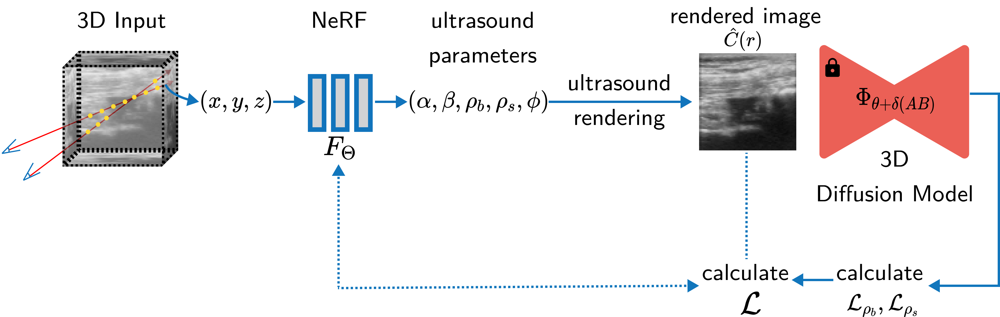
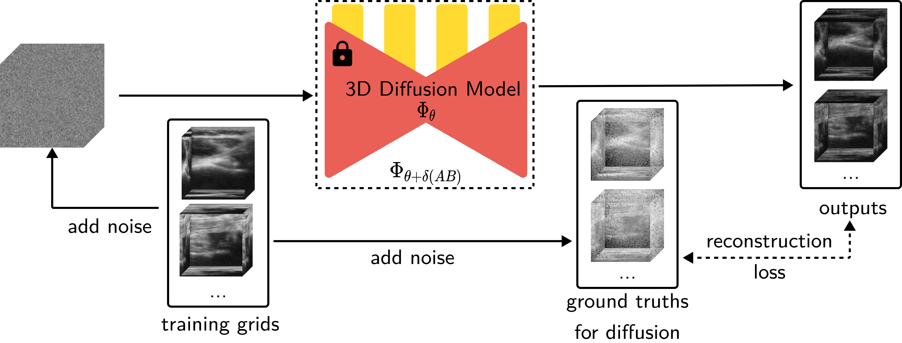

<div align="center">
<h2>NeRF-US👥: Removing Ultrasound Imaging Artifacts from Neural Radiance Fields in the Wild</h2>

<a href="https://twitter.com/intent/tweet?text=Wow:&url=https%3A%2F%2Fgithub.com%2FRishit-dagli%2Fnerf-us">
  
</a>
<a href="https://arxiv.org/abs/"></a>
<a href='https://rishitdagli.com/nerf-us'></a>
<a href='https://huggingface.co/papers/'></a>
<a href='https://huggingface.co/papers/'></a>
</div>

This work presents **NeRF-US**, a method to train NeRFs in-the-wild for sound fields like ultrasound imaging data. Check out our [website](https://rishitdagli.com/nerf-us/) to view some results of this work.

This codebase is forked from the awesome [Ultra-NeRF](https://github.com/magdalena-wysocki/ultra-nerf) and [Nerfbusters](https://github.com/ethanweber/nerfbusters) repository.



## Installation

1. First, install the pip package by running:

```bash
pip install nerfus
```

or you could also install the package from source:

```bash
git clone https://github.com/Rishit-Dagli/nerf-us
cd nerf-us
pip install -e .
```

2. Now install the dependencies, if you use the `virtualenv` you could run:

```bash
pip install -r requirements.txt
```

If you use `conda` you could run:

```bash
conda env create -f environment.yml
conda activate nerfus
```

3. Install Nerfstudio and dependencies. Installation guide can be found [install nerfstudio](https://docs.nerf.studio/en/latest/quickstart/installation.html)

> We also use the branch [nerfbusters-changes](https://github.com/nerfstudio-project/nerfstudio/tree/nerfbusters-changes). You may have to run the viewer locally if you want full functionality.

```bash
cd path/to/nerfstudio
pip install -e .
pip install torch==1.13.1 torchvision functorch --extra-index-url https://download.pytorch.org/whl/cu117
pip install git+https://github.com/NVlabs/tiny-cuda-nn/#subdirectory=bindings/torch
```

4. Install `binvox` to voxelize cubes

```bash
mkdir bins
cd bins
wget -O binvox https://www.patrickmin.com/binvox/linux64/binvox?rnd=16811490753710
cd ../
chmod +x bins/binvox
```

Check out the [Tips](#tips) section for tips on installing the requirements.

## Overview of Codebase

For data preparation, the `cubes` directory contains modules for processing 3D data, including dataset handling (`datasets3D.py`), rendering (`render.py`), and visualization (`visualize3D.py`). The `data_modules` directory further supports data management with modules for 3D cubes and a general datamodule for the diffusion model.

The diffusion model is primarily implemented in the `models` directory, which includes the core model definition (`model.py`), U-Net architecture (`unet.py`), and related utilities. The `lightning` directory contains the training logic for the diffusion model, including loss functions (`dsds_loss.py`) and the trainer module (`nerfus_trainer.py`). The NeRF component is housed in the `nerf` directory, which includes experiment configurations, utility functions, and the main pipeline for NeRF-US (`nerfus_pipeline.py`).



```
.
├── config (configuration files for the datasets and models)
│   ├── shapenet.yaml (configuration file for the shapenet dataset)
│   └── synthetic-knee.yaml (configuration file for the diffusion model)
├── environment.yml (conda environment file)
├── nerfus (main codebase)
│   ├── bins
│   │   └── binvox (binvox executable)
│   ├── cubes (making cubes from 3D data)
│   │   ├── __init__.py
│   │   ├── binvox_rw.py
│   │   ├── datasets3D.py
│   │   ├── render.py
│   │   ├── utils.py
│   │   └── visualize3D.py
│   ├── data
│   ├── data_modules (data modules for cubes)
│   │   ├── __init__.py
│   │   ├── cubes3d.py
│   │   └── datamodule.py (data module for diffusion model)
│   ├── download_nerfus_dataset.py (script to download the diffusion model dataset)
│   ├── lightning (training lightning modules for diffusion model)
│   │   ├── __init__.py
│   │   ├── dsds_loss.py (loss for diffusion model)
│   │   └── nerfus_trainer.py (training code for diffusion model)
│   ├── models (model definition for diffusion model)
│   │   ├── __init__.py
│   │   ├── fp16_util.py
│   │   ├── model.py
│   │   ├── nn.py
│   │   └── unet.py
│   ├── nerf (main codebase for the NeRF)
│   │   ├── experiment_configs (configurations for the Nerfacto experiments)
│   │   │   ├── __init__.py
│   │   │   ├── nerfacto_experiments.py
│   │   │   └── utils.py
│   │   ├── nerfbusters_utils.py (utils for nerfbusters)
│   │   ├── nerfus_config.py (nerfstudio method configurations for the NeRF-US)
│   │   └── nerfus_pipeline.py (pipeline for NeRF-US)
│   ├── run.py (training script for diffusion model)
│   └── utils (utility functions for the NeRF training)
│       ├── __init__.py
│       ├── metrics.py
│       ├── utils.py
│       └── visualizations.py
└── requirements.txt (requirements file we use)
```

## Usage

### Training the Diffusion Model

First, download either the synthetic knee cubes or the synthetic phantom cubes dataset:

```
.
├── config
│   ├── shapenet.yaml
│   └── synthetic-knee.yaml
├── nerfus
│   ├── bins
│   │   └── binvox
│   ├── data
│   |   ├── syn-knee
|   |   └── syn-spi
```

We can now train the 3D diffusion model using the following command:

```bash
python nerfus/run.py --config config/synthetic-knee.yaml --name synthetic-knee-experiment --pt
```

This also automatically downloads Nerfbusters checkpoint on which we run adaptation.

### Training the NeRF

Contrary to many other NeRF + Diffusion models we do not first train a NeRF and then continue training with the diffusion model as regularizee. Instead, we train we train it with the diffusion model from scratch.

We run the training using our method using Nerfstudio commands:

```bash
ns-train nerfus --data path/to/data nerfstudio-data --eval-mode train-split-fraction
```

For our baselines, and experiments we directly use the Nerfstudio commands to train on the 10 individual datasets. For our ablation study, we do 3 ablations:

1. for training without the border probability we just set the corresponding `lambda` to 0 (this could easily be made faster)
2. for training without the scaterring density we just set the corresponding `lambda` to 0 (this could easily be made faster)
3. for training without ultrasound rendering, we just use standard nerstudio commands

We can use any other Nerfstudio commands as well. For instance, rendering across a path:

```bash
ns-render --load-config path/to/config.yml  --traj filename --camera-path-filename path/to/camera-path.json --output-path renders/my-render.mp4
```

or computing metrics:

```bash
ns-render --load-config path/to/config.yml --output-path path/to/output
```

## Tips

We share some tips on running the code and reproducing our results.

### on installing required packages

- Installing Nerfstudio especially on HPC systems can be tricky. We recommend installing `open3d`, and `tiny-cuda-nn` before installing Nerfstudio separately and install it from source. We also recommend building these packages on the same GPU you plan to run it on.
- When you install PyTorch especially on HPC systems, you will often end up with atleast two version of CUDA: one which is installed when you install PyTorch and is not a full version of CUDA and the other which is in the system. We highly recommend manually installing the same version of CUDA as in the system that PyTorch automatically installs.
- There are some parts of the code that do not run properly with PyTorch 2.x.
- We use virtualenv and use the `requirements.txt` file to install the required packages. While, we provide a conda `environment.yml` (especially due to some Nerfstudio problems people might face), we have not tested this but expect it to work.

### on compute

- We have currently optimized the code for and run all of the experiments on a A100 - 80 GB GPU. However, we have also tested the code on a A100 - 40 GB GPU where the inference and evaluation seem to work pretty well.
- In general, we would recommend a GPU with at least above 40 GB vRAM.
- We would recommend having at least 32 GB CPU RAM for the code to work well.
- While training the diffusion model, we recommend doing full-precision adaptation and not use FP-16.

## Credits

This code base is built on top of, and thanks to them for maintaining the repositories:

- [Ultra-NeRF](https://github.com/magdalena-wysocki/ultra-nerf)
- [Nerfbusters](https://github.com/ethanweber/nerfbusters)
- [Nerfstudio](https://docs.nerf.studio/)

## Citation

If you find NeRF-US helpful, please consider citing:

```bibtex
```
